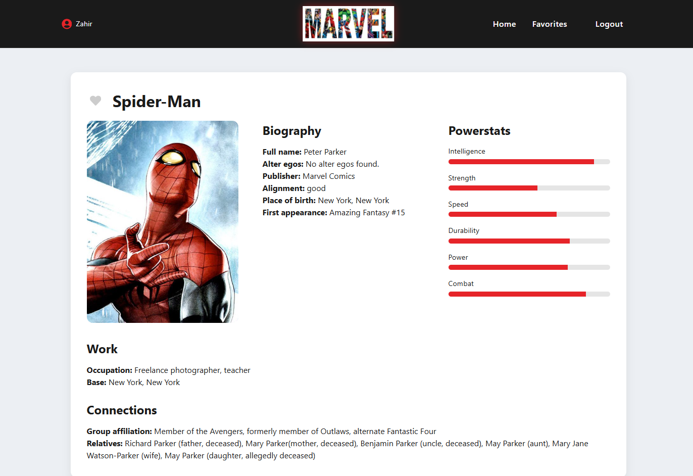

# Marvel Hero Application

## Inhoudsopgave
1. Inleiding
2. Screenshot
3. Benodigdheden
4. De applicatie draaien
5. Overige commando’s
6. Testgebruikers

---

## 1. Inleiding

### Doel van de applicatie
Deze applicatie is een interactieve Marvel Hero webapplicatie waarin gebruikers superhelden kunnen bekijken, details kunnen inzien en hun favoriete helden kunnen opslaan in een backend.

De applicatie maakt gebruik van de SuperHero API voor heldeninformatie en de NOVI Dynamic API voor authenticatie en opslag van gebruikersdata.

### Belangrijkste functionaliteiten
- Registreren en inloggen met JWT-authenticatie
- Beveiligde routes
- Overzicht van superhelden
- Detailpagina met uitgebreide informatie
- Favorieten opslaan in de backend
- Favorieten verwijderen
- Gebruikersprofiel met display name

---

## 2. Screenshot



---

## 3. Benodigdheden

Om deze applicatie lokaal te draaien is het volgende nodig:

- Node.js (versie 18 of hoger)
- npm
- Internetverbinding (voor API-calls)

Gebruikte technieken:
- React (Vite)
- React Router
- Axios
- React Context
- NOVI Dynamic API
- SuperHero API

---

## 4. De applicatie draaien

Volg onderstaande stappen om het project te installeren en te starten.

### Stap 1 – Project clonen

git clone https://github.com/ZahirR1985/marvel-eindopdracht

### Stap 2 – Dependencies installeren


```shell
npm install
```
Dit installeert automatisch alle dependencies die in package.json staan.

### Stap 3 – Omgevingsvariabelen
In de root van het project bevindt zich een .env bestand met de benodigde API-gegevens.
Dit bestand bevat:
* VITE_API_TOKEN=<SuperHero API token>
* VITE_NOVI_BASE_URL=
* VITE_NOVI_PROJECT_ID=

De benodigde API-gegevens zijn reeds ingevuld.
Er hoeft geen eigen API key te worden aangemaakt.

### Stap 4 – Applicatie starten

Start de development server met:

```shell
npm run dev
```
De applicatie is vervolgens bereikbaar via:

http://localhost:5173

### Testgebruikers

Er is een testaccount beschikbaar:

Email:

test@test.nl

Wachtwoord:

Test123

Daarnaast kan er ook een nieuw account worden aangemaakt via de registerpagina.

### JSON-configuratiebestand

Het JSON-configuratiebestand voor de NOVI Dynamic API is toegevoegd aan de root van het project.

Dit bestand bevat de configuratie voor:

Users

Profiles

Favorites

Bijbehorende permissies